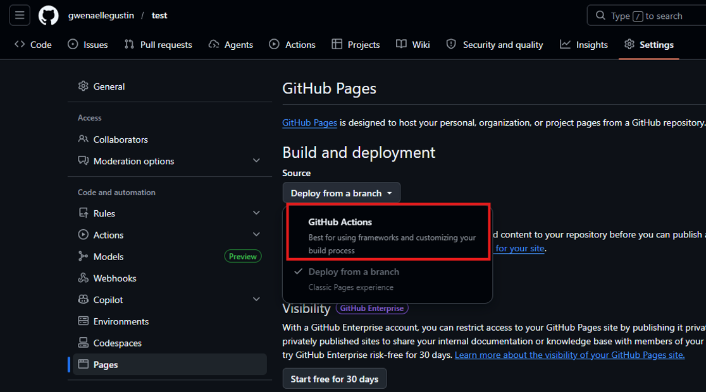
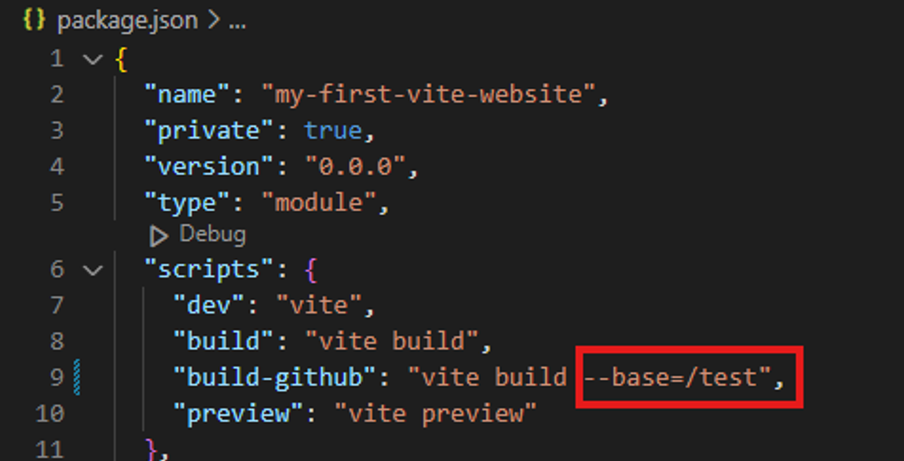
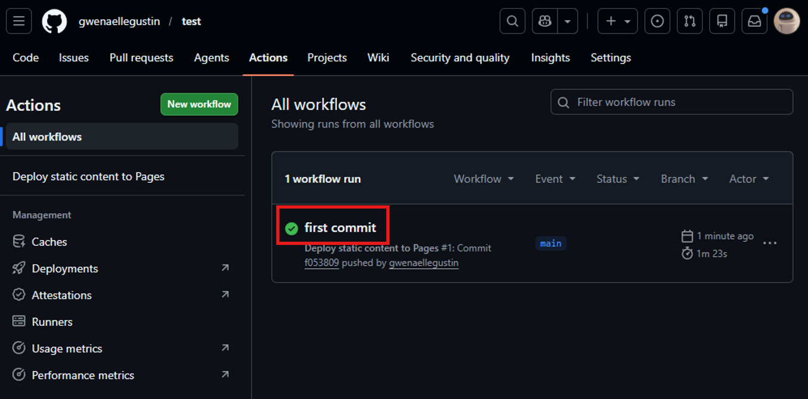

# Autodeploy website hosted on GitHub (free)
1.  Download this repository and unzip (OR `git clone` and delete .git folder)
2.  Create a PUBLIC project on your GitHub. The PROJECT NAME will be part of the URL (choose accordingly).
3.  In this project on GitHub, go to "Settings", "Pages" and select “GitHub Actions”

4.	Locally, edit package.json and replace "vite-autodeploy-example" with the PROJECT NAME.

5.  Locally, do the following commands
    ```
    git init
    git add .
    git commit -m "init commit"
    git branch -M main
    ```
    In the next command, replace [URL] with your project URL. Example: "https://github.com/gwenaellegustin/test.git"
    ```
    git remote add origin [URL]
    git push -u origin main
    ```
6.	Go to Actions and check the green check icon.

7.  Go to your website: https://[ACCOUNT-NAME].github.io/[PROJECT-NAME]/
Example: https://gwenaellegustin.github.io/vite-autodeploy-example/

# Test locally
- First time (installation): `npm i`
- Run website: `npm run dev`

# Edit
- **Code**: the content (body) of index.html is edited by JS in main.js
- **Assets**: public folder is for directly accessible files (favicon). Other assets can be put in src/assets.
- **Libraries**: to add an another library, run command `npm install --save ...`. Example with three.js `npm install --save three`
